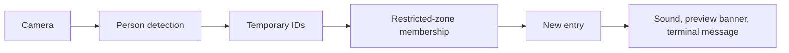

# TRACE build guide

## Current goal

Use a security camera to send an alert whenever a person enters a restricted area.
There is no dwell requirement, loitering detection, or crowd-detection rule in this
scope. The original PDF describes a broader project; this is the user's updated goal.

## Code structure

Follow the Clipcraft-style organization: small entry scripts, feature services,
and shared functions in one Utils class. Keep code in labeled blocks and avoid
adding a separate file for every small processing step.

| File | Responsibility |
| --- | --- |
| `main.py` | Read options and start monitoring. |
| `edit_zones.py` | Start the mouse zone editor. |
| `services/video_service.py` | Camera input, YOLO, tracking, and the video loop. |
| `services/zone_service.py` | Draw and save polygons. |
| `services/event_service.py` | Detect new restricted-area entries and notify locally. |
| `services/utils.py` | Shared settings, geometry, drawing, saving, and sound helpers. |

Use ordinary functions for stateless work. Keep classes only where data must
survive between frames or mouse events. Clipcraft is a reference, not a dependency.

## Monitoring flow

Run with `--alerts`. The video service enables YOLO and ByteTrack, checks zones,
and passes the current tracks to EntryAlerts. The event service compares each
track's current restricted-zone set with its previous set. A new membership
produces an alert immediately, with no persistence timer or cooldown.

Retain membership during brief tracking gaps so missed detections do not repeatedly
alert. An observed exit rearms the zone for that track. Forget membership when the
tracker forgets the ID. Reset all membership state after a camera reconnect.
A person already inside on startup/reconnect triggers an alert.

The pipeline uses the bottom-center of each box for zone membership. Ignore zones
suppress active-zone memberships. Multiple people and overlapping restricted zones
produce independent entry events. Tracking uses position and motion, so ID changes
can cause extra alerts; unseen exits cannot reliably be identified.

## Alerts

Current delivery is local: Windows sound, an on-screen latest-entry banner, and
one terminal message per entry. Sound is asynchronous so it does not block video.
No person identification, database, automatic recording, or remote delivery is
required for this local version. Do not add the old broader roadmap automatically.

The event dictionary contains event type, camera ID, track ID, zone ID/name, UTC
timestamp, and confidence. This is the connection point for a future delivery
channel if the user chooses phone or email alerts.

## Verify it

Run the automated checks described in the README. There are 47 checks, including
immediate entry, continuous presence, exit/re-entry, missed frames, ignored people,
multiple zones, and enabling the full pipeline with `--alerts`.

On the actual camera: draw a restricted zone, start alert mode, enter it, remain
inside, leave, and enter again. Expect one alert for each observed entry, with no
repeats while standing inside. Confirm sound volume and the visible banner locally.
Phone/email delivery still needs a chosen channel and its configuration.
