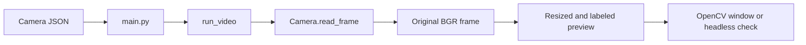
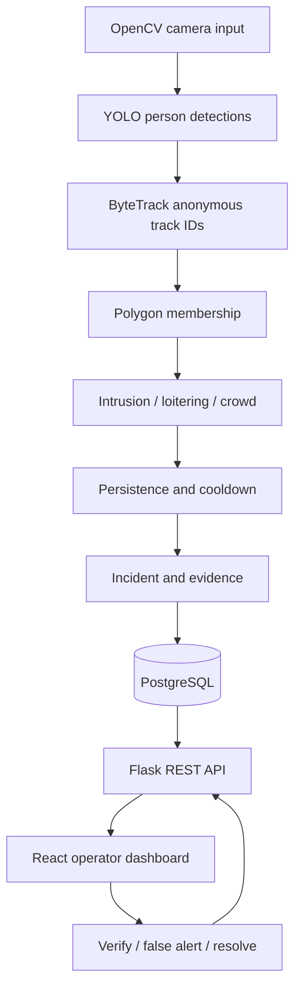

# TRACE build guide

## Phase 1: video input (implemented)

**What:** Read one video file, webcam, or RTSP stream and show labeled frames.
**Why:** Every later stage needs a stable supply of frames and predictable cleanup.
**Library:** OpenCV, plus Python's standard library.



Input is the camera configuration. Output is an OpenCV BGR image array for each
frame. `Camera.status` reports `ONLINE`, `OFFLINE`, or `ENDED` inside the process.
The worker returns a frame count and always releases the capture in `finally`.

Example using the shared utility class:

```python
from vision.utils import TraceUtils
from vision.worker import run_video

config = TraceUtils.load_camera_config("config/camera.local.json")
frame_count = run_video(config, headless=True, max_frames=100)
print("Frames read:", frame_count)
```

Success gate: play a real source, stop it cleanly, verify a saved frame, and run
the automated checks described in the README. Synthetic file tests establish
file decoding; they do not establish network camera reliability.

## How the full pipeline will fit together



Preserve the original frame for inference and zone coordinates. Resize only
the preview. `Detector.detect(frame)` in `vision/worker.py` now returns class,
confidence, class ID, and bounding box. `Tracker.update(detections, frame_shape,
timestamp)` attaches anonymous track IDs. `ZoneManager.assign_zones()` adds polygon
membership before the shared utilities draw the preview.

Keep stateful responsibilities in small classes: camera connection in `Camera`,
model in `Detector`, tracks in `Tracker`, and event timers in event detectors.
Use `TraceUtils` for shared stateless operations, rather than copying helpers
between files or turning the utility class into the entire application.

Use the same image coordinate system for boxes and polygons. Decide and document
zone membership before implementing events; a person's bounding-box bottom-center
point is a simple starting convention. Preview clicks must map back to original
image coordinates. Tracking IDs are temporary object labels, not identities.

For event timers, use elapsed monotonic time on live streams and video timestamps
on recorded footage. Wall-clock UTC belongs in incident records. Reset persistence
when someone leaves a zone or after a connection gap, so offline time cannot
confirm an event.

## Phase 2: YOLO person detection (implemented)

`vision/detector.py` loads pretrained YOLOv8n once and detects people on original
frames. Enable it with `--detect`. Settings and box drawing are shared functions
in `TraceUtils`. Input: an OpenCV BGR frame. Output: a list of class, confidence,
and bounding-box dictionaries. Empty detections return an empty list.

Install `requirements.txt` and follow the README's Phase 2 command. The automated
checks cover output conversion, empty results, coordinate alignment, and cleanup
after inference failure. The manual success gate is visible, correctly aligned
person boxes on your actual footage. Confirm that before adding ByteTrack.

## Phase 3: ByteTrack IDs (implemented)

`vision/tracker.py` converts detection dictionaries to Ultralytics `Boxes` and
passes them to `BYTETracker.update()`. The wrapper returns plain track dictionaries
with IDs, boxes, confidence, first/last observation times, and an empty zone field.
The existing utility draws both detections and tracks, so box drawing is shared.

Run with `--track` to enable the full detection and tracking path. The tracker
gets weaker detections for its second matching pass, ages missing tracks on empty
frames, prunes expired metadata, and resets after a successful camera reconnect.
Displayed IDs are not reused within the running session. See the README for
thresholds, timeline conventions, and the command.

Tests use actual ByteTrack with controlled detections to check moving people,
changed detection order, low-confidence rescue, brief gaps, expiry, and resets.
The manual success gate is stable IDs on your own walking footage. Tracking is
anonymous and camera-local; no cross-camera identity matching is implemented.

## Phase 4: polygon zones (implemented)

`vision/zones.py` validates polygons and checks the bottom-center point of each
person's box against every zone. Boundary points count as inside. Zones are stored
as normalized coordinates in each camera JSON and scaled to the original frame.
Shared geometry and drawing functions live in `TraceUtils`.

`edit_zones.py` opens a small mouse editor on one captured frame. Click corners
and press Enter to save; existing camera settings and other zones are preserved.
Restricted, loitering, crowd, and ignore types are supported. Multiple memberships
are retained; ignore zones override active zones and their counts.

Input: tracked-person dictionaries and camera zones. Output: track dictionaries
with zone IDs, names, types, a first current-zone ID, and an ignored flag. The
preview shows outlines, counts, and foot points. There are no incident timers yet.

Tests check inside/outside/boundary points, concave and invalid polygons, overlap,
ignore precedence, coordinate scaling, and editor persistence. Manual success
gate: draw a zone, restart with `--track`, and walk across its boundary; the label
should change when the foot point crosses. Next, add intrusion persistence.

## Build order and current progress

Phases 1–4 are implemented. Phases 5–15 remain planned.

| Phase | Files to add | Main responsibility | Success gate |
| --- | --- | --- | --- |
| 2: YOLO (implemented) | `vision/detector.py` | Pretrained person detection; configurable confidence and inference size. | Person boxes appear on representative footage. |
| 3: ByteTrack (implemented) | `vision/tracker.py` | Convert detections into stable anonymous track IDs. | IDs persist during a short walking sequence. |
| 4: Zones (implemented) | `vision/zones.py`, `vision/zone_editor.py` | Polygon membership, ignore zones, and mouse editing. | Known inside/outside points give expected results. |
| 5: Intrusion | `vision/detectors/base.py`, `intrusion.py` | Common event interface and per-track persistence. | Brief entries are ignored; sustained entries alert. |
| 6: Loitering | `vision/detectors/loitering.py` | Per-camera, zone, and track dwell timers. | Leaving resets dwell time. |
| 7: Crowd | `vision/detectors/crowd.py`, `vision/anomaly_engine.py` | Count zone occupants and require sustained crowding. | A transient crowd creates no incident. |
| 8: Storage | `backend/database/schema.sql`, `backend/services/incidents.py` | PostgreSQL cameras, zones, incidents, alert events, users. | Incidents survive process restart. |
| 9: Evidence | `vision/incident_manager.py`, `vision/evidence.py` | Annotated JPEG and FFmpeg clip from a bounded buffer. | Play pre-event and post-event footage. |
| 10: API | `backend/app.py`, `backend/api/` | Validated camera, zone, incident, review, and health endpoints. | Invalid requests fail clearly; valid changes persist. |
| 11: Dashboard | `frontend/src/pages/`, `components/`, `services/` | Dashboard, cameras, incidents, review, settings. | Operator can view actual stored evidence. |
| 12: Alerts | `backend/services/alerts.py` | Start with dashboard polling and durable alert records. | New incidents appear without reload; reconnect misses none. |
| 13: Feedback | Incident API and review page | Persist verified, false-alert, and resolved decisions. | Decisions remain after restart. |
| 14: Retention | `backend/services/retention.py` | Delete expired evidence except items marked KEEP. | Old media is removed; preserved items remain. |
| 15: Demo | `docs/DEMO.md` | Controlled scenarios and recovery rehearsal. | Complete the demonstration in 2–3 minutes. |

Plan evidence around a bounded rolling buffer: retain approximately five seconds
before an event and collect ten seconds afterward, then encode outside the frame
loop. Mark missing or failed evidence explicitly. Keep incidents stored even if
encoding fails. Finalize buffer size and frame sampling after measuring throughput.

Begin with one camera. For 1–4 cameras, evolve to one worker per camera, each with
its own capture, tracker, and rule state. Measure hardware capacity before adding
streams. Keep PostgreSQL and the API separate from inference so an inference
failure cannot erase previous incidents.

## Team integration

- **Vision:** phases 1–7, with agreed detection, track, and event dictionaries.
- **Backend:** schema, APIs, evidence integration, durable alerts, and retention.
- **Frontend:** pages and zone editor against agreed API examples.

After defining those interfaces, backend and frontend work can proceed alongside
vision. Integrate one real intrusion from source to reviewed incident before
adding loitering and crowd to the complete flow. Avoid adding fight, fall, identity
recognition, or retraining to this MVP.

## Demo target

Show normal footage, enter a restricted polygon, wait for persistence, open the
incident's snapshot and clip, and record an operator decision. Then briefly show
loitering and crowd events. Use a controlled local recording as a fallback when
camera connectivity is unreliable.
