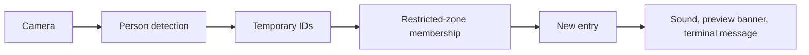

# TRACE build guide

## Current goal

Use a security camera to send an alert whenever a person enters a restricted area.
There is no dwell requirement, loitering detection, or crowd-detection rule in this
scope. The original PDF describes a broader project; this is the user's updated goal.
The user also requested short FFmpeg clips when somebody appears in the camera
frame. Return local MP4 paths for later storage.

## Code structure

Follow the Clipcraft-style organization: small entry scripts, feature services,
and shared functions in one Utils class. Keep code in labeled blocks and avoid
adding a separate file for every small processing step.

| File | Responsibility |
| --- | --- |
| `main.py` | Read options and start monitoring. |
| `edit_zones.py` | Start the mouse zone editor. |
| `services/video_service.py` | Camera input, YOLO, tracking, and the video loop. |
| `services/zone_service.py` | Draw and save polygons. |
| `services/event_service.py` | Detect new restricted-area entries and notify locally. |
| `services/clip_service.py` | Detect whole-frame appearances, collect short clips, and return MP4 paths. |
| `services/utils.py` | Shared settings, geometry, drawing, saving, and sound helpers. |

Use ordinary functions for stateless work. Keep classes only where data must
survive between frames or mouse events. Clipcraft is a reference, not a dependency.

## Monitoring flow

Run with `--alerts`. The video service enables YOLO and ByteTrack, checks zones,
and passes the current tracks to EntryAlerts. The event service compares each
track's current restricted-zone set with its previous set. A new membership
produces an alert immediately, with no persistence timer or cooldown.

Retain membership during brief tracking gaps so missed detections do not repeatedly
alert. An observed exit rearms the zone for that track. Forget membership when the
tracker forgets the ID. Reset all membership state after a camera reconnect.
A person already inside on startup/reconnect triggers an alert.

The pipeline uses the bottom-center of each box for zone membership. Ignore zones
suppress active-zone memberships. Multiple people and overlapping restricted zones
produce independent entry events. Tracking uses position and motion, so ID changes
can cause extra alerts; unseen exits cannot reliably be identified.

## Function walkthrough

Start with `process_frame()` in `video_service.py`. Its four numbered blocks
explain what happens to one image. `run_video()` repeats that work until the video
ends or you stop it, then releases the camera even if an error occurs.

| Function | What it does |
| --- | --- |
| `detect_and_track()` | Takes a camera frame and returns boxes, confidence scores, and IDs when tracking is enabled. |
| `Utils.assign_zones()` | Returns copies of those detections with zone IDs, names, and an ignored flag. |
| `EntryAlerts.check_entries()` | Compares current and previous zones and returns only new entry records. |
| `EntryAlerts.notify()` | Logs those entries, updates the latest banner message, and plays a sound if enabled. |
| `Utils.draw_frame_results()` | Draws zone outlines and detection boxes on the image. |
| `Utils.build_preview()` | Resizes the result and adds the camera label and latest alert. |
| `Utils.show_preview()` | Shows the image and returns whether monitoring should continue. |

A detection is an ordinary dictionary. For example, `bbox` is
`[left, top, right, bottom]` in pixels, `track_id` is the temporary person number,
and `zone_ids` lists the zones containing that person's foot point. The functions
add this information in order; resizing happens only after the zone checks.

Inside `EntryAlerts`, `get_restricted_zones()` filters out ignored objects and
non-person detections. `create_entry()` builds the alert dictionary.
`forget_expired_tracks()` removes IDs the tracker no longer remembers.
For example, person 7 outside the zone produces no entry; person 7 stepping
inside produces one; person 7 staying inside produces none. An observed exit
followed by another entry produces a second alert.

In the editor, `on_mouse()` routes clicks to a button action or `add_corner()`.
`draw_preview()` combines the saved zones, `draw_corners()`, and `draw_controls()`.
`save_zone()` validates the polygon before writing it to the camera configuration.

Keep reusable operations in `Utils`. Keep camera connections, model instances,
tracking history, alert membership, and editor clicks in their existing classes
because those values need to survive from one call to the next.

## Alerts

Current delivery is local: Windows sound, an on-screen latest-entry banner, and
one terminal message per entry. Sound is asynchronous so it does not block video.
No person identification, database, or remote delivery is required for this local
version. Do not add the old broader roadmap automatically.

The event dictionary contains event type, camera ID, track ID, zone ID/name, UTC
timestamp, and confidence. This is the connection point for a future delivery
channel if the user chooses phone or email alerts.

## Entry clips

`--clips` enables detection and tracking, even with no saved zones. The frame
function passes the original image, tracks, remembered IDs, and source timestamp
to `ClipRecorder.update()` before drawing preview overlays.

1. `find_entries()` identifies new people or returns after a configurable gap.
2. `start()` opens temporary storage only when an entry occurs.
3. `add_frame()` samples images at the configured rate and keeps their timestamps.
4. `finish()` calls `Utils.encode_clip()` and returns the completed MP4 path.
5. `close()` finishes a shorter clip on stop or EOF; `reset()` also clears IDs.

Defaults are five-second clips at 15 FPS with a two-second allowance for missed
detections. Arrivals during an active clip share its remaining duration. Clips
cover the whole view, including ignore zones. Restricted-area alert rules remain
separate. No pre-entry footage or audio is captured.

`Utils.encode_clip()` writes a concat manifest with frame durations, invokes
FFmpeg with H.264 output, and renames `.partial.mp4` only after success. This keeps
variable live detection speed from making playback run too fast. Encoding is
synchronous for this small version and pauses the monitoring loop while it runs;
there is no background queue. It has a timeout, and temporary files are cleaned.
`CLIP_READY` messages expose finished paths for later storage without adding a
database or upload service.

## Verify it

Run the automated checks described in the README. There are 58 checks, including
immediate entry, continuous presence, exit/re-entry, missed frames, ignored people,
multiple zones, and enabling the full pipeline with `--alerts`.
Clip tests include real FFmpeg encoding and readable output, timing, entry-only
selection, same-ID re-entry, EOF, reconnection, and failure cleanup.

On the actual camera: draw a restricted zone, start alert mode, enter it, remain
inside, leave, and enter again. Expect one alert for each observed entry, with no
repeats while standing inside. Confirm sound volume and the visible banner locally.
For clips, run `--clips`, enter the view, wait five seconds, and open the printed
MP4 path. Remaining visible should not keep creating clips. Leave for over two
seconds and return to check another entry.
